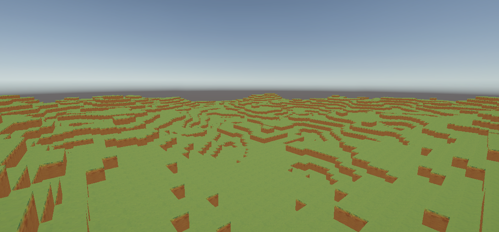

# Unity Voxel Game

C'est un template non fini de jeu voxel comme Minecraft, développé avec Unity, mon objectif est de fournir une expérience sandbox immersive avec génération procédurale de terrain.

## 🎮 Fonctionnalités Actuelles

### Système de Base
- ✅ Contrôles FPS fluides (WASD + souris)
- ✅ Placement et destruction de blocs basique
- ✅ Système de biomes initial
- ✅ Génération de terrain basique

## 🗺️ Roadmap

### Phase 1 : Système de Monde (En cours - 40% complété)
- [x] Génération procédurale de terrain par chunks
- [x] Système de biomes
- [ ] Gestion du chargement/déchargement des chunks
- [ ] Système de sauvegarde des modifications

### Phase 2 : Physique et Interactions (Non commencé)
- [ ] Système de physique réaliste
- [ ] Automates cellulaires pour les liquides
- [ ] Propagation des modifications (gravité, effondrement)
- [ ] Interactions entre les blocs

### Phase 3 : Interface et Inventaire (Non commencé)
- [ ] Interface utilisateur de base
- [ ] Système d'inventaire
- [ ] Menu pause
- [ ] Interface de debug

### Phase 4 : Gameplay Avancé (Non commencé)
- [ ] Crafting
- [ ] Système jour/nuit
- [ ] Météo dynamique
- [ ] Dégâts de chute

### Phase 5 : Multijoueur (Non commencé)
- [ ] Support réseau de base
- [ ] Synchronisation des chunks
- [ ] Chat in-game
- [ ] Sauvegarde/chargement multijoueur

### Phase 6 : Contenu (Non commencé)
- [ ] Mobs hostiles et passifs
- [ ] Système de combat
- [ ] Agriculture
- [ ] Système de quêtes basique

### Phase 7 : Optimisation et Polish (Non commencé)
- [ ] LOD (Level of Detail) pour les chunks distants
- [ ] Optimisation des performances
- [ ] UI/UX améliorée
- [ ] Effets sonores et musique
- [ ] Menu principal et options

## 🛠️ Installation

1. Clonez le repository
2. Ouvrez le projet dans Unity (version 2022.x ou supérieure)
3. Ouvrez la scène principale dans `Assets/Scenes/Main.scene`
4. Appuyez sur Play !

## 🎮 Contrôles

- **WASD** : Déplacement
- **Espace** : Saut
- **Shift** : Sprint
- **Clic Gauche** : Détruire un bloc
- **Clic Droit** : Placer un bloc
- **E** : Ouvrir l'inventaire
- **Échap** : Menu pause

## 🤝 Contribution

Les contributions sont les bienvenues ! N'hésitez pas à :
1. Fork le projet
2. Créer une branche pour votre fonctionnalité
3. Commit vos changements
4. Push sur votre fork
5. Ouvrir une Pull Request

## 📝 License

Ce projet est sous licence MIT - voir le fichier [LICENSE.md](LICENSE.md) pour plus de détails.

## 🙏 Remerciements

- Unity Technologies pour le moteur de jeu
- La communauté Minecraft pour l'inspiration
- Tous les contributeurs du projet

---
Développé avec ❤️ par Thurzas

